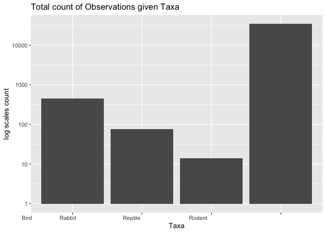
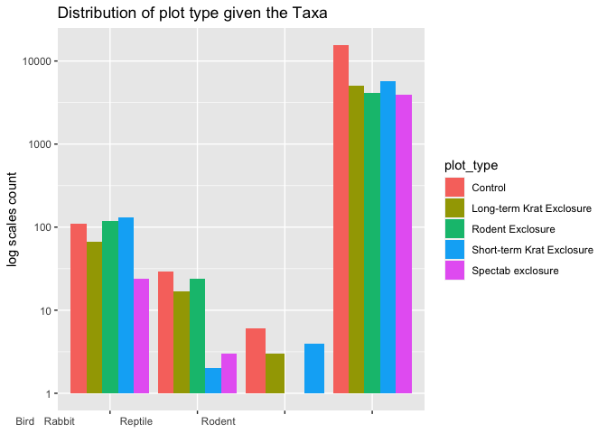
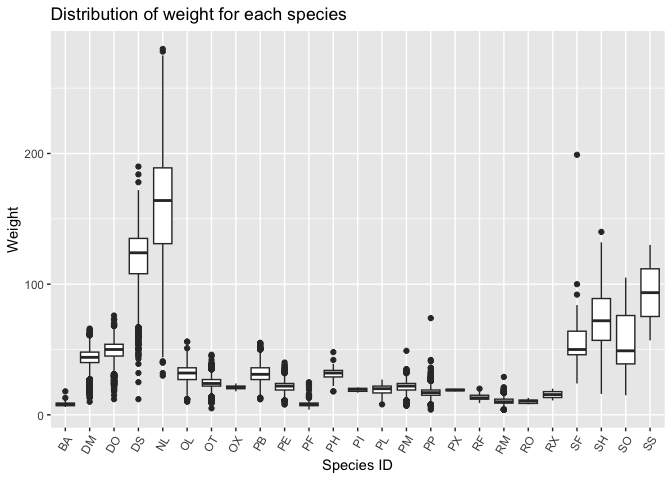
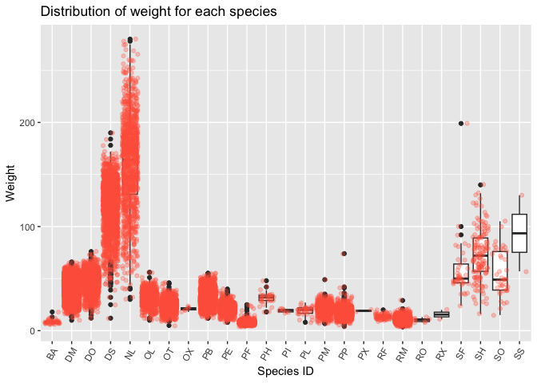
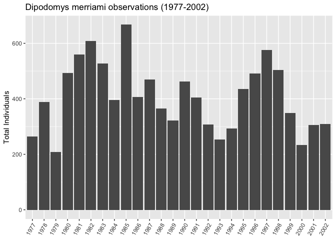
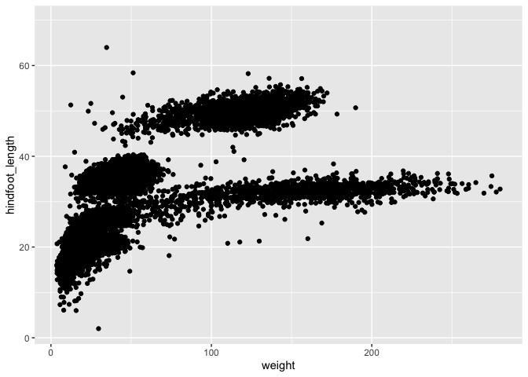
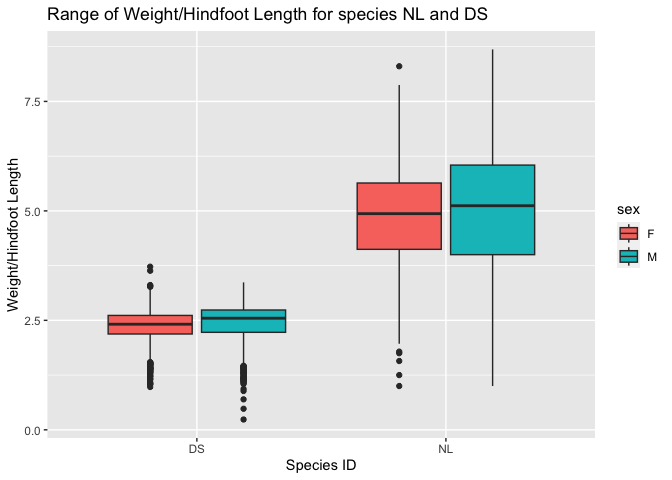
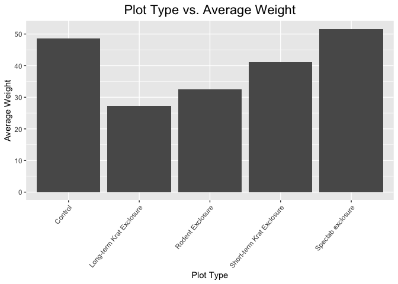

## Instructions
Answer the following questions and complete the exercises in RMarkdown. Please embed all of your code and push your final work to your repository. Your final lab report should be organized, clean, and run free from errors. Remember, you must remove the `#` for the included code chunks to run. Be sure to add your name to the author header above. For any included plots, make sure they are clearly labeled. You are free to use any plot type that you feel best communicates the results of your analysis.  

Make sure to use the formatting conventions of RMarkdown to make your report neat and clean!  

## Load the libraries

```r
library(tidyverse)
library(janitor)
library(here)
library(naniar)
```

## Desert Ecology
For this assignment, we are going to use a modified data set on [desert ecology](http://esapubs.org/archive/ecol/E090/118/). The data are from: S. K. Morgan Ernest, Thomas J. Valone, and James H. Brown. 2009. Long-term monitoring and experimental manipulation of a Chihuahuan Desert ecosystem near Portal, Arizona, USA. Ecology 90:1708.

```r
deserts <- read_csv(here("lab10", "data", "surveys_complete.csv"))
```

```
## Rows: 34786 Columns: 13
## ── Column specification ────────────────────────────────────────────────────────
## Delimiter: ","
## chr (6): species_id, sex, genus, species, taxa, plot_type
## dbl (7): record_id, month, day, year, plot_id, hindfoot_length, weight
## 
## ℹ Use `spec()` to retrieve the full column specification for this data.
## ℹ Specify the column types or set `show_col_types = FALSE` to quiet this message.
```

1. Use the function(s) of your choice to get an idea of its structure, including how NA's are treated. Are the data tidy?  
There are NAs as NAs, and the data is tidy. 

```r
glimpse(deserts)
```

```
## Rows: 34,786
## Columns: 13
## $ record_id       <dbl> 1, 2, 3, 4, 5, 6, 7, 8, 9, 10, 11, 12, 13, 14, 15, 16,…
## $ month           <dbl> 7, 7, 7, 7, 7, 7, 7, 7, 7, 7, 7, 7, 7, 7, 7, 7, 7, 7, …
## $ day             <dbl> 16, 16, 16, 16, 16, 16, 16, 16, 16, 16, 16, 16, 16, 16…
## $ year            <dbl> 1977, 1977, 1977, 1977, 1977, 1977, 1977, 1977, 1977, …
## $ plot_id         <dbl> 2, 3, 2, 7, 3, 1, 2, 1, 1, 6, 5, 7, 3, 8, 6, 4, 3, 2, …
## $ species_id      <chr> "NL", "NL", "DM", "DM", "DM", "PF", "PE", "DM", "DM", …
## $ sex             <chr> "M", "M", "F", "M", "M", "M", "F", "M", "F", "F", "F",…
## $ hindfoot_length <dbl> 32, 33, 37, 36, 35, 14, NA, 37, 34, 20, 53, 38, 35, NA…
## $ weight          <dbl> NA, NA, NA, NA, NA, NA, NA, NA, NA, NA, NA, NA, NA, NA…
## $ genus           <chr> "Neotoma", "Neotoma", "Dipodomys", "Dipodomys", "Dipod…
## $ species         <chr> "albigula", "albigula", "merriami", "merriami", "merri…
## $ taxa            <chr> "Rodent", "Rodent", "Rodent", "Rodent", "Rodent", "Rod…
## $ plot_type       <chr> "Control", "Long-term Krat Exclosure", "Control", "Rod…
```

```r
naniar::miss_var_summary(deserts)
```

```
## # A tibble: 13 × 3
##    variable        n_miss pct_miss
##    <chr>            <int>    <dbl>
##  1 hindfoot_length   3348     9.62
##  2 weight            2503     7.20
##  3 sex               1748     5.03
##  4 record_id            0     0   
##  5 month                0     0   
##  6 day                  0     0   
##  7 year                 0     0   
##  8 plot_id              0     0   
##  9 species_id           0     0   
## 10 genus                0     0   
## 11 species              0     0   
## 12 taxa                 0     0   
## 13 plot_type            0     0
```

```r
deserts
```

```
## # A tibble: 34,786 × 13
##    record…¹ month   day  year plot_id speci…² sex   hindf…³ weight genus species
##       <dbl> <dbl> <dbl> <dbl>   <dbl> <chr>   <chr>   <dbl>  <dbl> <chr> <chr>  
##  1        1     7    16  1977       2 NL      M          32     NA Neot… albigu…
##  2        2     7    16  1977       3 NL      M          33     NA Neot… albigu…
##  3        3     7    16  1977       2 DM      F          37     NA Dipo… merria…
##  4        4     7    16  1977       7 DM      M          36     NA Dipo… merria…
##  5        5     7    16  1977       3 DM      M          35     NA Dipo… merria…
##  6        6     7    16  1977       1 PF      M          14     NA Pero… flavus 
##  7        7     7    16  1977       2 PE      F          NA     NA Pero… eremic…
##  8        8     7    16  1977       1 DM      M          37     NA Dipo… merria…
##  9        9     7    16  1977       1 DM      F          34     NA Dipo… merria…
## 10       10     7    16  1977       6 PF      F          20     NA Pero… flavus 
## # … with 34,776 more rows, 2 more variables: taxa <chr>, plot_type <chr>, and
## #   abbreviated variable names ¹​record_id, ²​species_id, ³​hindfoot_length
```

2. How many genera and species are represented in the data? What are the total number of observations? Which species is most/ least frequently sampled in the study?

There are 26 different genera and 40 different species represented in the data.

```r
deserts %>% 
summarize(genus_distinct = n_distinct(genus),
            species_distinct = n_distinct(species))
```

```
## # A tibble: 1 × 2
##   genus_distinct species_distinct
##            <int>            <int>
## 1             26               40
```
Based on our NA analysis in question 1, we can sum the number of observations from genus to get the total number of observations, 34786.  

```r
deserts %>% 
  count(genus) %>% 
  arrange(desc(n)) %>% 
  summarise(total_observations = sum(n))
```

```
## # A tibble: 1 × 1
##   total_observations
##                <int>
## 1              34786
```


```r
deserts %>% 
  count(species) %>% 
  arrange(desc(n)) 
```

```
## # A tibble: 40 × 2
##    species          n
##    <chr>        <int>
##  1 merriami     10596
##  2 penicillatus  3123
##  3 ordii         3027
##  4 baileyi       2891
##  5 megalotis     2609
##  6 spectabilis   2504
##  7 torridus      2249
##  8 flavus        1597
##  9 eremicus      1299
## 10 albigula      1252
## # … with 30 more rows
```

3. What is the proportion of taxa included in this study? Show a table and plot that reflects this count.

```r
deserts %>% 
  count(taxa)
```

```
## # A tibble: 4 × 2
##   taxa        n
##   <chr>   <int>
## 1 Bird      450
## 2 Rabbit     75
## 3 Reptile    14
## 4 Rodent  34247
```


```r
deserts %>% 
  ggplot(aes(x=taxa))+
  geom_bar(na.rm = T) +
  scale_y_log10() +
   theme(axis.text.x = element_text(hjust = 5))+
   labs(title = "Total count of Observations given Taxa ",
       x = "Taxa",
       y = "log scales count")
```

<!-- -->

4. For the taxa included in the study, use the fill option to show the proportion of individuals sampled by `plot_type.`

```r
options(scipen=999)
```


```r
deserts %>% 
  ggplot(aes(x = taxa, fill = plot_type)) + 
  geom_bar(position = "dodge") +
  scale_y_log10()+
  theme(axis.text.x = element_text(hjust = 5))+
   labs(title = "Distribution of plot type given the Taxa ",
       x = NULL,
       y = "log scales count")
```

<!-- -->

5. What is the range of weight for each species included in the study? Remove any observations of weight that are NA so they do not show up in the plot.

```r
names(deserts)
```

```
##  [1] "record_id"       "month"           "day"             "year"           
##  [5] "plot_id"         "species_id"      "sex"             "hindfoot_length"
##  [9] "weight"          "genus"           "species"         "taxa"           
## [13] "plot_type"
```


```r
deserts %>% 
  filter(weight != "NA") %>% 
  ggplot(aes(x=species_id,y=weight))+
  geom_boxplot(na.rm = T)+
  theme(axis.text.x = element_text(angle = 60, hjust = 1))+
  labs(title = "Distribution of weight for each species",
       x = "Species ID",
       y = "Weight")
```

<!-- -->

6. Add another layer to your answer from #4 using `geom_point` to get an idea of how many measurements were taken for each species.

```r
deserts %>% 
  filter(weight != "NA") %>% 
  ggplot(aes(x=species_id,y=weight))+
  geom_boxplot(na.rm = T)+
  geom_point(alpha = 0.3, color = "tomato", position = "jitter")+
  theme(axis.text.x = element_text(angle = 60, hjust = 1))+
  labs(title = "Distribution of weight for each species",
       x = "Species ID",
       y = "Weight")
```

<!-- -->

7. [Dipodomys merriami](https://en.wikipedia.org/wiki/Merriam's_kangaroo_rat) is the most frequently sampled animal in the study. How have the number of observations of this species changed over the years included in the study?

Based on the graph, we can see on average there is a downward trend in population, which is hard to see looking purely at the table as there are almost alternating years of relatively low and relatively high counts. 

```r
deserts %>% 
  filter(species_id == "DM") %>% 
  group_by(year) %>% 
  summarize(annual_total = n())
```

```
## # A tibble: 26 × 2
##     year annual_total
##    <dbl>        <int>
##  1  1977          264
##  2  1978          389
##  3  1979          209
##  4  1980          493
##  5  1981          559
##  6  1982          609
##  7  1983          528
##  8  1984          396
##  9  1985          667
## 10  1986          406
## # … with 16 more rows
```

```r
deserts %>% 
  filter(species_id=="DM")%>% 
  group_by(year) %>% 
  summarize(annual_total = n()) %>% 
  ggplot(aes(x=as.factor(year),y=annual_total))+
    geom_col()+
    theme(axis.text.x = element_text(angle = 60, hjust = 1))+
    labs(title = "Dipodomys merriami observations (1977-2002)",
         x = NULL, 
         y = "Total Individuals")
```

<!-- -->

8. What is the relationship between `weight` and `hindfoot` length? Consider whether or not over plotting is an issue.
I personally cannot see any major difference between `geom_point` and `geom_jitter`. Furthermore, the relationship between weight and hindfoot length has four different cluster of data. Overall, the trend seems to be as weight increases, the hindfoot length also increases. 

```r
deserts %>% 
  ggplot(aes(x=weight, y=hindfoot_length)) +
  geom_jitter(na.rm = T)
```

<!-- -->

```r
deserts %>% 
  ggplot(aes(x=weight, y=hindfoot_length)) +
  geom_point(na.rm = T)
```

<!-- -->

9. Which two species have, on average, the highest weight? Once you have identified them, make a new column that is a ratio of `weight` to `hindfoot_length`. Make a plot that shows the range of this new ratio and fill by sex.

```r
deserts %>% 
  select(species,weight,hindfoot_length) %>% 
  group_by(species) %>% 
  summarize(average_weight = mean(weight, na.rm = T)) %>% 
  arrange(desc(average_weight))
```

```
## # A tibble: 40 × 2
##    species      average_weight
##    <chr>                 <dbl>
##  1 albigula              159. 
##  2 spectabilis           120. 
##  3 spilosoma              93.5
##  4 hispidus               65.6
##  5 fulviventer            58.9
##  6 ochrognathus           55.4
##  7 ordii                  48.9
##  8 merriami               43.2
##  9 baileyi                31.7
## 10 leucogaster            31.6
## # … with 30 more rows
```


```r
deserts %>% 
  filter(species == "albigula"| species == "spectabilis") %>% 
  select(species, species_id)
```

```
## # A tibble: 3,756 × 2
##    species     species_id
##    <chr>       <chr>     
##  1 albigula    NL        
##  2 albigula    NL        
##  3 spectabilis DS        
##  4 spectabilis DS        
##  5 spectabilis DS        
##  6 albigula    NL        
##  7 spectabilis DS        
##  8 albigula    NL        
##  9 spectabilis DS        
## 10 spectabilis DS        
## # … with 3,746 more rows
```


```r
deserts %>% 
  filter(species_id == "NL" | species_id == "DS") %>% 
  filter(weight != "NA" & hindfoot_length != "NA" & sex != "NA") %>% 
  mutate(ratio = weight/hindfoot_length) %>% 
  select(species_id, sex, weight, hindfoot_length, ratio) %>% 
  ggplot(aes(x=species_id, y=ratio, fill=sex))+
  geom_boxplot()+
  labs(title = "Range of Weight/Hindfoot Length for species NL and DS",        x = "Species ID",
       y = "Weight/Hindfoot Length")
```

<!-- -->

10. Make one plot of your choice! Make sure to include at least two of the aesthetics options you have learned.

```r
glimpse(deserts)
```

```
## Rows: 34,786
## Columns: 13
## $ record_id       <dbl> 1, 2, 3, 4, 5, 6, 7, 8, 9, 10, 11, 12, 13, 14, 15, 16,…
## $ month           <dbl> 7, 7, 7, 7, 7, 7, 7, 7, 7, 7, 7, 7, 7, 7, 7, 7, 7, 7, …
## $ day             <dbl> 16, 16, 16, 16, 16, 16, 16, 16, 16, 16, 16, 16, 16, 16…
## $ year            <dbl> 1977, 1977, 1977, 1977, 1977, 1977, 1977, 1977, 1977, …
## $ plot_id         <dbl> 2, 3, 2, 7, 3, 1, 2, 1, 1, 6, 5, 7, 3, 8, 6, 4, 3, 2, …
## $ species_id      <chr> "NL", "NL", "DM", "DM", "DM", "PF", "PE", "DM", "DM", …
## $ sex             <chr> "M", "M", "F", "M", "M", "M", "F", "M", "F", "F", "F",…
## $ hindfoot_length <dbl> 32, 33, 37, 36, 35, 14, NA, 37, 34, 20, 53, 38, 35, NA…
## $ weight          <dbl> NA, NA, NA, NA, NA, NA, NA, NA, NA, NA, NA, NA, NA, NA…
## $ genus           <chr> "Neotoma", "Neotoma", "Dipodomys", "Dipodomys", "Dipod…
## $ species         <chr> "albigula", "albigula", "merriami", "merriami", "merri…
## $ taxa            <chr> "Rodent", "Rodent", "Rodent", "Rodent", "Rodent", "Rod…
## $ plot_type       <chr> "Control", "Long-term Krat Exclosure", "Control", "Rod…
```

```r
deserts %>% 
  group_by(plot_type) %>% 
  summarise(ave_weight = mean(weight, na.rm = T)) %>% 
  ggplot(aes(x=plot_type, y=ave_weight))+
    geom_col(na.rm = T)+
    labs(title = "Plot Type vs. Average Weight",
       x = "Plot Type",
       y = "Average Weight") +
  theme(plot.title = element_text(size = rel(1.5), hjust = 0.5))+
  theme(axis.text.x = element_text(angle = 50, hjust = 1))
```

<!-- -->


## Push your final code to GitHub!
Please be sure that you check the `keep md` file in the knit preferences. 
