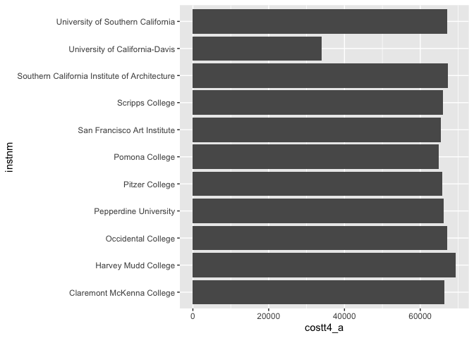
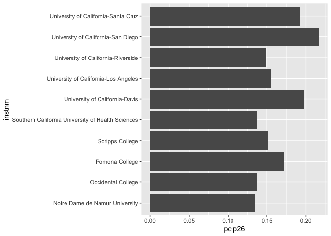

## Instructions
Answer the following questions and complete the exercises in RMarkdown. Please embed all of your code and push your final work to your repository. Your final lab report should be organized, clean, and run free from errors. Remember, you must remove the `#` for the included code chunks to run. Be sure to add your name to the author header above.  

Make sure to use the formatting conventions of RMarkdown to make your report neat and clean!  

## Load the libraries

```r
library(tidyverse)
library(janitor)
library(here)
library(naniar)
```

For this homework, we will take a departure from biological data and use data about California colleges. These data are a subset of the national college scorecard (https://collegescorecard.ed.gov/data/). Load the `ca_college_data.csv` as a new object called `colleges`.

```r
here()
```

```
## [1] "/Users/laurinecabiling/Desktop/BIS15W2023_lcabiling"
```

```r
colleges <- read_csv(here("lab9", "data", "ca_college_data.csv"))
```

```
## Rows: 341 Columns: 10
## ── Column specification ────────────────────────────────────────────────────────
## Delimiter: ","
## chr (4): INSTNM, CITY, STABBR, ZIP
## dbl (6): ADM_RATE, SAT_AVG, PCIP26, COSTT4_A, C150_4_POOLED, PFTFTUG1_EF
## 
## ℹ Use `spec()` to retrieve the full column specification for this data.
## ℹ Specify the column types or set `show_col_types = FALSE` to quiet this message.
```

```r
colleges
```

```
## # A tibble: 341 × 10
##    INSTNM      CITY  STABBR ZIP   ADM_R…¹ SAT_AVG PCIP26 COSTT…² C150_…³ PFTFT…⁴
##    <chr>       <chr> <chr>  <chr>   <dbl>   <dbl>  <dbl>   <dbl>   <dbl>   <dbl>
##  1 Grossmont … El C… CA     9202…      NA      NA 0.0016    7956  NA       0.355
##  2 College of… Visa… CA     9327…      NA      NA 0.0066    8109  NA       0.541
##  3 College of… San … CA     9440…      NA      NA 0.0038    8278  NA       0.357
##  4 Ventura Co… Vent… CA     9300…      NA      NA 0.0035    8407  NA       0.382
##  5 Oxnard Col… Oxna… CA     9303…      NA      NA 0.0085    8516  NA       0.275
##  6 Moorpark C… Moor… CA     9302…      NA      NA 0.0151    8577  NA       0.429
##  7 Skyline Co… San … CA     9406…      NA      NA 0         8580   0.233   0.231
##  8 Glendale C… Glen… CA     9120…      NA      NA 0.002     9181  NA       0.421
##  9 Citrus Col… Glen… CA     9174…      NA      NA 0.0021    9281  NA       0.440
## 10 Fresno Cit… Fres… CA     93741      NA      NA 0.0324    9370  NA       0.366
## # … with 331 more rows, and abbreviated variable names ¹​ADM_RATE, ²​COSTT4_A,
## #   ³​C150_4_POOLED, ⁴​PFTFTUG1_EF
```
The variables are a bit hard to decipher, here is a key:  

INSTNM: Institution name  
CITY: California city  
STABBR: Location state  
ZIP: Zip code  
ADM_RATE: Admission rate  
SAT_AVG: SAT average score  
PCIP26: Percentage of degrees awarded in Biological And Biomedical Sciences  
COSTT4_A: Annual cost of attendance  
C150_4_POOLED: 4-year completion rate  
PFTFTUG1_EF: Percentage of undergraduate students who are first-time, full-time degree/certificate-seeking undergraduate students  

1. Use your preferred function(s) to have a look at the data and get an idea of its structure. Make sure you summarize NA's and determine whether or not the data are tidy. You may also consider dealing with any naming issues.

```r
glimpse(colleges)
```

```
## Rows: 341
## Columns: 10
## $ INSTNM        <chr> "Grossmont College", "College of the Sequoias", "College…
## $ CITY          <chr> "El Cajon", "Visalia", "San Mateo", "Ventura", "Oxnard",…
## $ STABBR        <chr> "CA", "CA", "CA", "CA", "CA", "CA", "CA", "CA", "CA", "C…
## $ ZIP           <chr> "92020-1799", "93277-2214", "94402-3784", "93003-3872", …
## $ ADM_RATE      <dbl> NA, NA, NA, NA, NA, NA, NA, NA, NA, NA, NA, NA, NA, NA, …
## $ SAT_AVG       <dbl> NA, NA, NA, NA, NA, NA, NA, NA, NA, NA, NA, NA, NA, NA, …
## $ PCIP26        <dbl> 0.0016, 0.0066, 0.0038, 0.0035, 0.0085, 0.0151, 0.0000, …
## $ COSTT4_A      <dbl> 7956, 8109, 8278, 8407, 8516, 8577, 8580, 9181, 9281, 93…
## $ C150_4_POOLED <dbl> NA, NA, NA, NA, NA, NA, 0.2334, NA, NA, NA, NA, 0.1704, …
## $ PFTFTUG1_EF   <dbl> 0.3546, 0.5413, 0.3567, 0.3824, 0.2753, 0.4286, 0.2307, …
```


```r
naniar::miss_var_summary(colleges)
```

```
## # A tibble: 10 × 3
##    variable      n_miss pct_miss
##    <chr>          <int>    <dbl>
##  1 SAT_AVG          276     80.9
##  2 ADM_RATE         240     70.4
##  3 C150_4_POOLED    221     64.8
##  4 COSTT4_A         124     36.4
##  5 PFTFTUG1_EF       53     15.5
##  6 PCIP26            35     10.3
##  7 INSTNM             0      0  
##  8 CITY               0      0  
##  9 STABBR             0      0  
## 10 ZIP                0      0
```


```r
colleges <- clean_names(colleges)
colleges
```

```
## # A tibble: 341 × 10
##    instnm      city  stabbr zip   adm_r…¹ sat_avg pcip26 costt…² c150_…³ pftft…⁴
##    <chr>       <chr> <chr>  <chr>   <dbl>   <dbl>  <dbl>   <dbl>   <dbl>   <dbl>
##  1 Grossmont … El C… CA     9202…      NA      NA 0.0016    7956  NA       0.355
##  2 College of… Visa… CA     9327…      NA      NA 0.0066    8109  NA       0.541
##  3 College of… San … CA     9440…      NA      NA 0.0038    8278  NA       0.357
##  4 Ventura Co… Vent… CA     9300…      NA      NA 0.0035    8407  NA       0.382
##  5 Oxnard Col… Oxna… CA     9303…      NA      NA 0.0085    8516  NA       0.275
##  6 Moorpark C… Moor… CA     9302…      NA      NA 0.0151    8577  NA       0.429
##  7 Skyline Co… San … CA     9406…      NA      NA 0         8580   0.233   0.231
##  8 Glendale C… Glen… CA     9120…      NA      NA 0.002     9181  NA       0.421
##  9 Citrus Col… Glen… CA     9174…      NA      NA 0.0021    9281  NA       0.440
## 10 Fresno Cit… Fres… CA     93741      NA      NA 0.0324    9370  NA       0.366
## # … with 331 more rows, and abbreviated variable names ¹​adm_rate, ²​costt4_a,
## #   ³​c150_4_pooled, ⁴​pftftug1_ef
```

2. Which cities in California have the highest number of colleges?

```r
names(colleges)
```

```
##  [1] "instnm"        "city"          "stabbr"        "zip"          
##  [5] "adm_rate"      "sat_avg"       "pcip26"        "costt4_a"     
##  [9] "c150_4_pooled" "pftftug1_ef"
```

```r
colleges %>% 
  count(city) %>% 
  arrange(desc(n))
```

```
## # A tibble: 161 × 2
##    city              n
##    <chr>         <int>
##  1 Los Angeles      24
##  2 San Diego        18
##  3 San Francisco    15
##  4 Sacramento       10
##  5 Berkeley          9
##  6 Oakland           9
##  7 Claremont         7
##  8 Pasadena          6
##  9 Fresno            5
## 10 Irvine            5
## # … with 151 more rows
```
Los Angeles has the highest number of colleges, we also know this is the true amount of institutions in each city as there are zero NAs for institutions.

3. Based on your answer to #2, make a plot that shows the number of colleges in the top 10 cities.

```r
colleges_top_10_cities <- colleges %>% 
  count(city) %>% 
  arrange(desc(n)) %>% 
  slice(1:10) 
colleges_top_10_cities
```

```
## # A tibble: 10 × 2
##    city              n
##    <chr>         <int>
##  1 Los Angeles      24
##  2 San Diego        18
##  3 San Francisco    15
##  4 Sacramento       10
##  5 Berkeley          9
##  6 Oakland           9
##  7 Claremont         7
##  8 Pasadena          6
##  9 Fresno            5
## 10 Irvine            5
```

```r
colleges_top_10_cities %>% 
  ggplot(aes(x=city, y=n)) + 
  geom_col()+
  coord_flip()
```

<!-- -->

4. The column `COSTT4_A` is the annual cost of each institution. Which city has the highest average cost? Where is it located?

```r
colleges %>% 
  select(instnm, city, costt4_a) %>% 
  arrange(desc(costt4_a))%>% 
  slice_max(costt4_a)
```

```
## # A tibble: 1 × 3
##   instnm              city      costt4_a
##   <chr>               <chr>        <dbl>
## 1 Harvey Mudd College Claremont    69355
```

5. Based on your answer to #4, make a plot that compares the cost of the individual colleges in the most expensive city. Bonus! Add UC Davis here to see how it compares :>).

```r
colleges %>% 
  select(instnm, city, costt4_a) %>% 
  arrange(desc(costt4_a)) %>% 
  slice(1:10, 66) %>% 
  ggplot(aes(x=instnm, y=costt4_a)) +
           geom_col(na.rm = T) +
           coord_flip()
```

<!-- -->

6. The column `ADM_RATE` is the admissions rate by college and `C150_4_POOLED` is the four-year completion rate. Use a scatterplot to show the relationship between these two variables. What do you think this means?

```r
colleges %>% 
  ggplot(aes(x=adm_rate, y=c150_4_pooled)) +
  geom_point(na.rm = T)
```

<!-- -->
As the admission rate increases, there is a decrease in the completion rate of four years.  

7. Is there a relationship between cost and four-year completion rate? (You don't need to do the stats, just produce a plot). What do you think this means?

```r
colleges %>% 
  ggplot(aes(x=costt4_a, y=c150_4_pooled))+
  geom_point(na.rm = T)
```

<!-- -->
As annual cost of attendance increases, the is an increase in the four-year completion rate.  

8. The column titled `INSTNM` is the institution name. We are only interested in the University of California colleges. Make a new data frame that is restricted to UC institutions. You can remove `Hastings College of Law` and `UC San Francisco` as we are only interested in undergraduate institutions.

```r
uc_instit <- colleges %>% 
  filter_all(any_vars(str_detect(., pattern = "University of California")))
uc_instit
```

```
## # A tibble: 10 × 10
##    instnm      city  stabbr zip   adm_r…¹ sat_avg pcip26 costt…² c150_…³ pftft…⁴
##    <chr>       <chr> <chr>  <chr>   <dbl>   <dbl>  <dbl>   <dbl>   <dbl>   <dbl>
##  1 University… La J… CA     92093   0.357    1324  0.216   31043   0.872   0.662
##  2 University… Irvi… CA     92697   0.406    1206  0.107   31198   0.876   0.725
##  3 University… Rive… CA     92521   0.663    1078  0.149   31494   0.73    0.811
##  4 University… Los … CA     9009…   0.180    1334  0.155   33078   0.911   0.661
##  5 University… Davis CA     9561…   0.423    1218  0.198   33904   0.850   0.605
##  6 University… Sant… CA     9506…   0.578    1201  0.193   34608   0.776   0.786
##  7 University… Berk… CA     94720   0.169    1422  0.105   34924   0.916   0.709
##  8 University… Sant… CA     93106   0.358    1281  0.108   34998   0.816   0.708
##  9 University… San … CA     9410…  NA          NA NA          NA  NA      NA    
## 10 University… San … CA     9414…  NA          NA NA          NA  NA      NA    
## # … with abbreviated variable names ¹​adm_rate, ²​costt4_a, ³​c150_4_pooled,
## #   ⁴​pftftug1_ef
```

Remove `Hastings College of Law` and `UC San Francisco` and store the final data frame as a new object `univ_calif_final`.

```r
univ_calif_final <- uc_instit %>% 
  filter(instnm != "University of California-Hastings College of Law" & instnm != "University of California-San Francisco")
univ_calif_final
```

```
## # A tibble: 8 × 10
##   instnm       city  stabbr zip   adm_r…¹ sat_avg pcip26 costt…² c150_…³ pftft…⁴
##   <chr>        <chr> <chr>  <chr>   <dbl>   <dbl>  <dbl>   <dbl>   <dbl>   <dbl>
## 1 University … La J… CA     92093   0.357    1324  0.216   31043   0.872   0.662
## 2 University … Irvi… CA     92697   0.406    1206  0.107   31198   0.876   0.725
## 3 University … Rive… CA     92521   0.663    1078  0.149   31494   0.73    0.811
## 4 University … Los … CA     9009…   0.180    1334  0.155   33078   0.911   0.661
## 5 University … Davis CA     9561…   0.423    1218  0.198   33904   0.850   0.605
## 6 University … Sant… CA     9506…   0.578    1201  0.193   34608   0.776   0.786
## 7 University … Berk… CA     94720   0.169    1422  0.105   34924   0.916   0.709
## 8 University … Sant… CA     93106   0.358    1281  0.108   34998   0.816   0.708
## # … with abbreviated variable names ¹​adm_rate, ²​costt4_a, ³​c150_4_pooled,
## #   ⁴​pftftug1_ef
```

Use `separate()` to separate institution name into two new columns "UNIV" and "CAMPUS".

```r
univ_calif_final <- univ_calif_final %>% 
  separate(instnm, into = c("univ", "campus"), sep = "-")
```

9. The column `ADM_RATE` is the admissions rate by campus. Which UC has the lowest and highest admissions rates? Produce a numerical summary and an appropriate plot.

```r
univ_calif_final %>% 
  arrange(desc(adm_rate)) %>% 
  select(univ,campus,adm_rate)
```

```
## # A tibble: 8 × 3
##   univ                     campus        adm_rate
##   <chr>                    <chr>            <dbl>
## 1 University of California Riverside        0.663
## 2 University of California Santa Cruz       0.578
## 3 University of California Davis            0.423
## 4 University of California Irvine           0.406
## 5 University of California Santa Barbara    0.358
## 6 University of California San Diego        0.357
## 7 University of California Los Angeles      0.180
## 8 University of California Berkeley         0.169
```
The UC that has the lowest admissions rates is UC Berkeley and and the UC with the highest admissions rates is UC Riverside.


```r
univ_calif_final %>% 
  arrange(desc(adm_rate)) %>% 
  select(univ,campus,adm_rate) %>% 
  ggplot(aes(x=campus,y=adm_rate))+
  geom_col()
```

<!-- -->

10. If you wanted to get a degree in biological or biomedical sciences, which campus confers the majority of these degrees? Produce a numerical summary and an appropriate plot.

```r
names(colleges)
```

```
##  [1] "instnm"        "city"          "stabbr"        "zip"          
##  [5] "adm_rate"      "sat_avg"       "pcip26"        "costt4_a"     
##  [9] "c150_4_pooled" "pftftug1_ef"
```


```r
colleges %>% 
  select(instnm, pcip26) %>% 
  arrange(desc(pcip26)) %>% 
  slice(1:10)
```

```
## # A tibble: 10 × 2
##    instnm                                            pcip26
##    <chr>                                              <dbl>
##  1 University of California-San Diego                 0.216
##  2 University of California-Davis                     0.198
##  3 University of California-Santa Cruz                0.193
##  4 Pomona College                                     0.171
##  5 University of California-Los Angeles               0.155
##  6 Scripps College                                    0.152
##  7 University of California-Riverside                 0.149
##  8 Occidental College                                 0.137
##  9 Southern California University of Health Sciences  0.136
## 10 Notre Dame de Namur University                     0.135
```


```r
colleges %>% 
  select(instnm, pcip26) %>% 
  arrange(desc(pcip26)) %>% 
  slice(1:10) %>% 
  ggplot(aes(x=instnm, y=pcip26))+
    geom_col()+
    coord_flip()
```

<!-- -->

## Knit Your Output and Post to [GitHub](https://github.com/FRS417-DataScienceBiologists)
