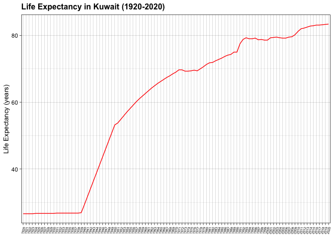
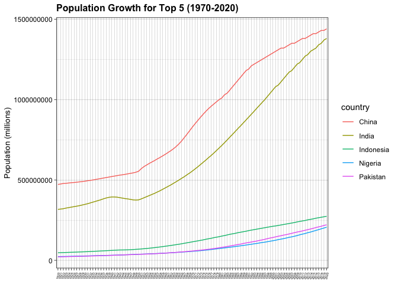
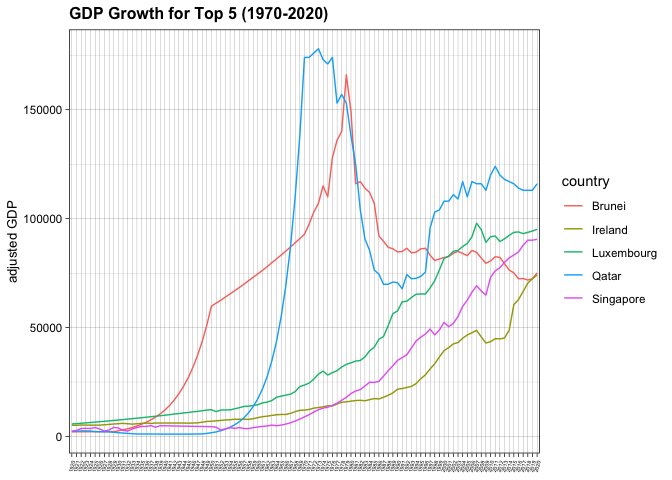
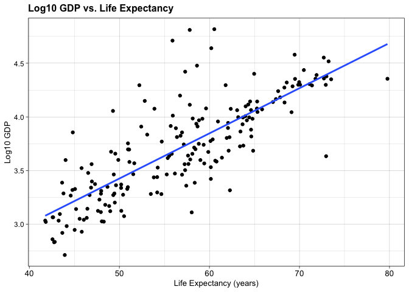

## Instructions
Answer the following questions and complete the exercises in RMarkdown. Please embed all of your code and push your final work to your repository. Your code should be organized, clean, and run free from errors. Be sure to **add your name** to the author header above. You may use any resources to answer these questions (including each other), but you may not post questions to Open Stacks or external help sites. There are 10 total questions.  

Make sure to use the formatting conventions of RMarkdown to make your report neat and clean! Your plots should use consistent aesthetics throughout.  

This exam is due by **12:00p on Tuesday, February 22**.  

## Load the libraries

```r
library(tidyverse)
```

```
## ── Attaching packages ─────────────────────────────────────── tidyverse 1.3.2 ──
## ✔ ggplot2 3.4.0     ✔ purrr   1.0.1
## ✔ tibble  3.1.8     ✔ dplyr   1.1.0
## ✔ tidyr   1.3.0     ✔ stringr 1.5.0
## ✔ readr   2.1.3     ✔ forcats 1.0.0
## ── Conflicts ────────────────────────────────────────── tidyverse_conflicts() ──
## ✖ dplyr::filter() masks stats::filter()
## ✖ dplyr::lag()    masks stats::lag()
```

```r
library(janitor)
```

```
## 
## Attaching package: 'janitor'
## 
## The following objects are masked from 'package:stats':
## 
##     chisq.test, fisher.test
```

```r
options(scipen=999) #disables scientific notation when printing
```


```r
library(here)
```

```
## here() starts at /Users/laurinecabiling/Desktop/BIS15W2023_lcabiling
```

## Gapminder
For this assignment, we are going to use data from  [gapminder](https://www.gapminder.org/). Gapminder includes information about economics, population, social issues, and life expectancy from countries all over the world. We will use three data sets, so please load all three.  

1. population_total.csv  
2. income_per_person_gdppercapita_ppp_inflation_adjusted.csv  
3. life_expectancy_years.csv  


```r
population <- read_csv(here("practice_midterm2", "data", "population_total.csv"))
```

```
## Rows: 195 Columns: 302
## ── Column specification ────────────────────────────────────────────────────────
## Delimiter: ","
## chr   (1): country
## dbl (301): 1800, 1801, 1802, 1803, 1804, 1805, 1806, 1807, 1808, 1809, 1810,...
## 
## ℹ Use `spec()` to retrieve the full column specification for this data.
## ℹ Specify the column types or set `show_col_types = FALSE` to quiet this message.
```


```r
income <- read_csv(here("practice_midterm2", "data", "income_per_person_gdppercapita_ppp_inflation_adjusted.csv"))
```

```
## Rows: 193 Columns: 242
## ── Column specification ────────────────────────────────────────────────────────
## Delimiter: ","
## chr   (1): country
## dbl (241): 1800, 1801, 1802, 1803, 1804, 1805, 1806, 1807, 1808, 1809, 1810,...
## 
## ℹ Use `spec()` to retrieve the full column specification for this data.
## ℹ Specify the column types or set `show_col_types = FALSE` to quiet this message.
```


```r
life_expectancy <- read_csv(here("practice_midterm2", "data", "life_expectancy_years.csv"))
```

```
## Rows: 187 Columns: 302
## ── Column specification ────────────────────────────────────────────────────────
## Delimiter: ","
## chr   (1): country
## dbl (301): 1800, 1801, 1802, 1803, 1804, 1805, 1806, 1807, 1808, 1809, 1810,...
## 
## ℹ Use `spec()` to retrieve the full column specification for this data.
## ℹ Specify the column types or set `show_col_types = FALSE` to quiet this message.
```

1. (3 points) Once you have an idea of the structure of the data, please make each data set tidy (hint: think back to pivots) and store them as new objects. You will need both the original (wide) and tidy (long) data!  

```r
income_long <- income %>% 
  pivot_longer(-country,
               names_to = "year",
               values_to = "income") %>% 
  mutate(country=as_factor(country))
```


```r
population_long <- population %>% 
  pivot_longer(-country,
               names_to = "year",
               values_to = "population")%>% 
  mutate(country=as_factor(country))
```


```r
life_expectancy_long <- life_expectancy %>% 
  pivot_longer(-country,
               names_to = "year",
               values_to = "life_expectancy")%>% 
  mutate(country=as_factor(country))
```

2. (1 point) How many different countries are represented in the data? Provide the total number and their names. Since each data set includes different numbers of countries, you will need to do this for each one.  

```r
income_long %>% summarize(n_countries=n_distinct(country))
```

```
## # A tibble: 1 × 1
##   n_countries
##         <int>
## 1         193
```


```r
income_long %>% count(country) %>% select(country)
```

```
## # A tibble: 193 × 1
##    country            
##    <fct>              
##  1 Afghanistan        
##  2 Albania            
##  3 Algeria            
##  4 Andorra            
##  5 Angola             
##  6 Antigua and Barbuda
##  7 Argentina          
##  8 Armenia            
##  9 Australia          
## 10 Austria            
## # … with 183 more rows
```


```r
life_expectancy_long %>% summarize(n_countries=n_distinct(country))
```

```
## # A tibble: 1 × 1
##   n_countries
##         <int>
## 1         187
```


```r
life_expectancy_long %>% count(country) %>% select(country)
```

```
## # A tibble: 187 × 1
##    country            
##    <fct>              
##  1 Afghanistan        
##  2 Albania            
##  3 Algeria            
##  4 Andorra            
##  5 Angola             
##  6 Antigua and Barbuda
##  7 Argentina          
##  8 Armenia            
##  9 Australia          
## 10 Austria            
## # … with 177 more rows
```


```r
population_long %>% summarize(n_countries=n_distinct(country))
```

```
## # A tibble: 1 × 1
##   n_countries
##         <int>
## 1         195
```


```r
population_long %>% count(country) %>% select(country)
```

```
## # A tibble: 195 × 1
##    country            
##    <fct>              
##  1 Afghanistan        
##  2 Albania            
##  3 Algeria            
##  4 Andorra            
##  5 Angola             
##  6 Antigua and Barbuda
##  7 Argentina          
##  8 Armenia            
##  9 Australia          
## 10 Austria            
## # … with 185 more rows
```

## Life Expectancy  

3. (2 points) Let's limit the data to 100 years (1920-2020). For these years, which country has the highest average life expectancy? How about the lowest average life expectancy?  

Highest

```r
life_expectancy_long %>% 
  filter(year >= 1920 & year <= 2020) %>% 
  group_by(country) %>% 
  summarize(mean_life_expectancy=mean(life_expectancy)) %>% 
  arrange(desc(mean_life_expectancy))
```

```
## # A tibble: 187 × 2
##    country        mean_life_expectancy
##    <fct>                         <dbl>
##  1 Sweden                         73.5
##  2 Norway                         73.2
##  3 Netherlands                    73.0
##  4 Iceland                        72.9
##  5 Australia                      72.7
##  6 Switzerland                    72.7
##  7 Denmark                        71.9
##  8 Canada                         71.8
##  9 New Zealand                    71.4
## 10 United Kingdom                 71.1
## # … with 177 more rows
```

Lowest

```r
life_expectancy_long %>% 
  filter(year >= 1920 & year <= 2020) %>% 
  group_by(country) %>% 
  summarize(mean_life_expectancy=mean(life_expectancy)) %>% 
  arrange(mean_life_expectancy)
```

```
## # A tibble: 187 × 2
##    country                  mean_life_expectancy
##    <fct>                                   <dbl>
##  1 Central African Republic                 41.8
##  2 Mali                                     41.8
##  3 Ethiopia                                 42.6
##  4 Sierra Leone                             42.6
##  5 Guinea-Bissau                            42.6
##  6 Burundi                                  42.8
##  7 Malawi                                   42.8
##  8 Uganda                                   43.3
##  9 Eritrea                                  43.4
## 10 Yemen                                    43.6
## # … with 177 more rows
```

4. (3 points) Although we can see which country has the highest life expectancy for the past 100 years, we don't know which countries have changed the most. What are the top 5 countries that have experienced the biggest improvement in life expectancy between 1920-2020?  

```r
life_expectancy_long %>% 
  filter(year >= 1920 & year <= 2020) %>% 
  pivot_wider(names_from = year,
              values_from = life_expectancy) %>% 
  select(country, `1920`, `2020`) %>% 
  mutate(delta=`2020`-`1920`) %>% 
  top_n(5, delta)
```

```
## # A tibble: 5 × 4
##   country         `1920` `2020` delta
##   <fct>            <dbl>  <dbl> <dbl>
## 1 Kuwait            26.6   83.4  56.8
## 2 Kyrgyz Republic   16.6   73.1  56.5
## 3 South Korea       28.2   83.2  55  
## 4 Tajikistan        16.7   71    54.3
## 5 Turkmenistan      15.2   70.5  55.3
```


5. (3 points) Make a plot that shows the change over the past 100 years for the country with the biggest improvement in life expectancy. Be sure to add appropriate aesthetics to make the plot clean and clear. Once you have made the plot, do a little internet searching and see if you can discover what historical event may have contributed to this remarkable change.  

_In 1938, oil was discovered in Kuwait._  


```r
kuwait <- life_expectancy_long %>% 
  filter(country=="Kuwait") %>% 
  filter(year >= 1920 & year <= 2020) %>%
  select(year, life_expectancy)%>% 
  ggplot(aes(x=year, y=life_expectancy, group=1))+
  geom_line(color="red")
```


```r
kuwait +
  theme_linedraw()+
  theme(plot.title = element_text(size = 12, face = "bold"),
        axis.title = element_text(size = 10),
        axis.text.x = element_text(angle=75, hjust = 1, size=5)) +
  labs(title = "Life Expectancy in Kuwait (1920-2020)",
       x = NULL,
       y = "Life Expectancy (years)")
```

<!-- -->

## Population Growth
6. (3 points) Which 5 countries have had the highest population growth over the past 100 years (1920-2020)?  

```r
population_long %>% 
  filter(year >= 1920 & year <= 2020) %>% 
  filter(year=="1920" | year=="2020") %>% 
  pivot_wider(names_from = year,
              values_from = population) %>% 
  mutate(delta=`2020`-`1920`) %>% 
  top_n(5, delta) %>% 
  arrange(desc(delta))
```

```
## # A tibble: 5 × 4
##   country          `1920`     `2020`      delta
##   <fct>             <dbl>      <dbl>      <dbl>
## 1 India         317000000 1380000000 1063000000
## 2 China         472000000 1440000000  968000000
## 3 Indonesia      47300000  274000000  226700000
## 4 United States 111000000  331000000  220000000
## 5 Pakistan       21700000  221000000  199300000
```

7. (4 points) Produce a plot that shows the 5 countries that have had the highest population growth over the past 100 years (1920-2020). Which countries appear to have had exponential growth?  

_India and China_  


```r
population %>% 
  filter(country=="India" | country=="China" | country=="Pakistan" | country=="Indonesia" | country=="Nigeria") %>% 
  pivot_longer(-country,
               names_to = "year",
               values_to="population") %>% 
  filter(year>=1920 & year<=2020) %>% 
  ggplot(aes(x=year, y=population, group=country, color=country))+
  geom_line()+
  theme_linedraw()+
  theme(plot.title = element_text(size = 12, face = "bold"),
        axis.title = element_text(size = 10),
        axis.text.x = element_text(angle=75, hjust = 1, size=4)) +
  labs(title = "Population Growth for Top 5 (1970-2020)",
       x = NULL,
       y = "Population (millions)")
```

<!-- -->

## Income
The units used for income are gross domestic product per person adjusted for differences in purchasing power in international dollars.

8. (4 points) As in the previous questions, which countries have experienced the biggest growth in per person GDP. Show this as a table and then plot the changes for the top 5 countries. With a bit of research, you should be able to explain the dramatic downturns of the wealthiest economies that occurred during the 1980's.  

```r
income_long %>% 
  filter(year >= 1920 & year <= 2020) %>% 
  filter(year=="1920" | year=="2020") %>% 
  pivot_wider(names_from = year,
              values_from = income) %>% 
  mutate(delta=`2020`-`1920`) %>% 
  top_n(5, delta) %>% 
  arrange(desc(delta))
```

```
## # A tibble: 5 × 4
##   country    `1920` `2020`  delta
##   <fct>       <dbl>  <dbl>  <dbl>
## 1 Qatar        2300 116000 113700
## 2 Luxembourg   5730  95100  89370
## 3 Singapore    2440  90500  88060
## 4 Brunei       2130  75100  72970
## 5 Ireland      5170  74100  68930
```


```r
income %>% 
  filter(country=="Qatar" | country=="Luxembourg" | country=="Singapore" | country=="Brunei" | country=="Ireland") %>% 
  pivot_longer(-country,
               names_to = "year",
               values_to="income") %>% 
  filter(year>=1920 & year<=2020) %>% 
  ggplot(aes(x=as.factor(year), y=income, group=country, color=country))+
  geom_line()+
  theme_linedraw()+
  theme(plot.title = element_text(size = 12, face = "bold"),
        axis.title = element_text(size = 10),
        axis.text.x = element_text(angle=75, hjust = 1, size=4)) +
  labs(title = "GDP Growth for Top 5 (1970-2020)",
       x = NULL,
       y = "adjusted GDP")
```

<!-- -->

9. (3 points) Create three new objects that restrict each data set (life expectancy, population, income) to the years 1920-2020. Hint: I suggest doing this with the long form of your data. Once this is done, merge all three data sets using the code I provide below. You may need to adjust the code depending on how you have named your objects. I called mine `life_expectancy_100`, `population_100`, and `income_100`. For some of you, learning these `joins` will be important for your project.  

```r
life_expectancy_100 <- 
  life_expectancy_long %>% 
  filter(year >= 1920 & year <= 2020)
```


```r
population_100 <- 
  population_long %>% 
  filter(year >= 1920 & year <= 2020)
```


```r
income_100 <- 
  income_long %>% 
  filter(year >= 1920 & year <= 2020)
```


```r
gapminder_join <- inner_join(life_expectancy_100, population_100, by= c("country", "year"))
gapminder_join <- inner_join(gapminder_join, income_100, by= c("country", "year"))
gapminder_join
```

```
## # A tibble: 18,887 × 5
##    country     year  life_expectancy population income
##    <fct>       <chr>           <dbl>      <dbl>  <dbl>
##  1 Afghanistan 1920             30.6   10600000   1490
##  2 Afghanistan 1921             30.7   10500000   1520
##  3 Afghanistan 1922             30.8   10300000   1550
##  4 Afghanistan 1923             30.8    9710000   1570
##  5 Afghanistan 1924             30.9    9200000   1600
##  6 Afghanistan 1925             31      8720000   1630
##  7 Afghanistan 1926             31      8260000   1650
##  8 Afghanistan 1927             31.1    7830000   1680
##  9 Afghanistan 1928             31.1    7420000   1710
## 10 Afghanistan 1929             31.2    7100000   1740
## # … with 18,877 more rows
```

10. (4 points) Use the joined data to perform an analysis of your choice. The analysis should include a comparison between two or more of the variables `life_expectancy`, `population`, or `income.`  

_Is there a relationship between GDP and life expectancy?_


```r
gapminder_join %>% 
  group_by(country) %>% 
  summarize(mean_life_expectancy=mean(life_expectancy, na.rm=T),
            mean_income=mean(income, na.rm=T),
            mean_population=mean(population, na.rm=T))
```

```
## # A tibble: 187 × 4
##    country             mean_life_expectancy mean_income mean_population
##    <fct>                              <dbl>       <dbl>           <dbl>
##  1 Afghanistan                         43.8       1939.       14364950.
##  2 Albania                             61.4       4170.        2103921.
##  3 Algeria                             56.3       7850.       18523663.
##  4 Andorra                             79.8      22644.          33919.
##  5 Angola                              44.0       3964.       10088218.
##  6 Antigua and Barbuda                 63.2       9941.          58739.
##  7 Argentina                           65.8      11752.       25267327.
##  8 Armenia                             60.2       3403.        2258119.
##  9 Australia                           72.7      22795.       13247228.
## 10 Austria                             68.6      20916.        7453564.
## # … with 177 more rows
```


```r
gapminder_join %>% 
  group_by(country) %>% 
  summarize(mean_life_expectancy=mean(life_expectancy, na.rm=T),
            mean_income=mean(income, na.rm=T)) %>% 
  ggplot(aes(x=mean_life_expectancy, y=log10(mean_income)))+
  geom_point()+
  geom_smooth(method=lm, se=F)+
  theme_linedraw()+
  theme(plot.title = element_text(size = 12, face = "bold"),
        axis.title = element_text(size = 10),
        axis.text.x = element_text(size=10)) +
  labs(title = "Log10 GDP vs. Life Expectancy",
       x = "Life Expectancy (years)",
       y = "Log10 GDP")
```

```
## `geom_smooth()` using formula = 'y ~ x'
```

<!-- -->
